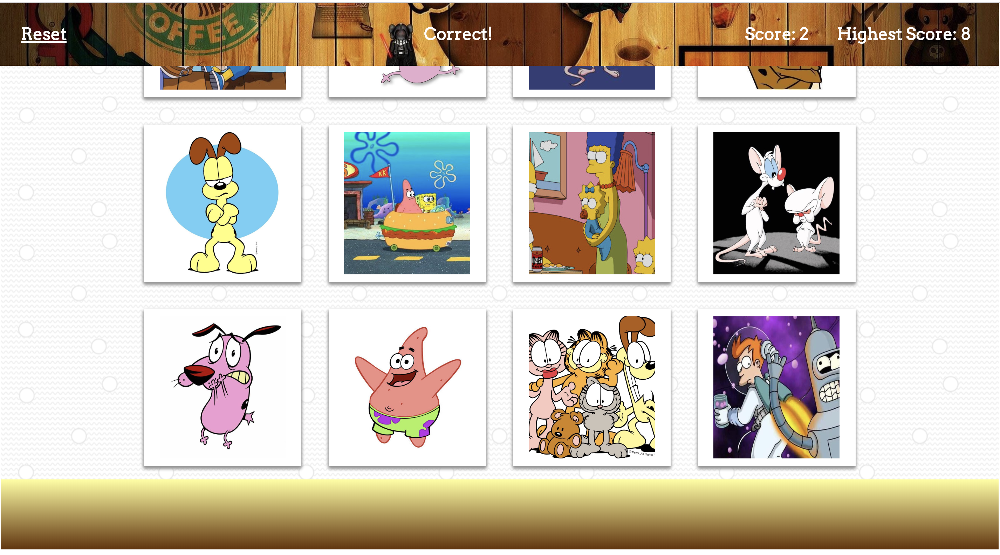

## Cartoon Memory Game

Memory game application built with React.
In this game, users must not click on the same image twice in order to win points.
Once the same image is clicked twice, the game resets and the highest score is displayed. 

## Technologies 

Javascript, ES6, React, Bootstrap, CSS, HTML.
Through the use of React, the main elements used in this app are:
- Components and props
- State and lifecycle
- Rendering elements via ReactDOM
- Event handling
- JSX

The application's UI is broken into components where their states can be managed and respond to user events. 

## Features : 

- Rendering of different images to the screen, where each image listens for click events 
- Track of user's score and highest score 
- Image shuffling 
- App deployed on Heroku

 
 

 
 

